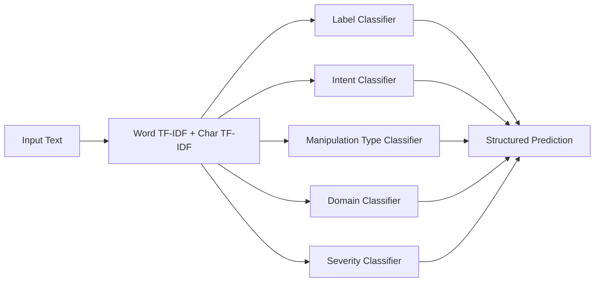
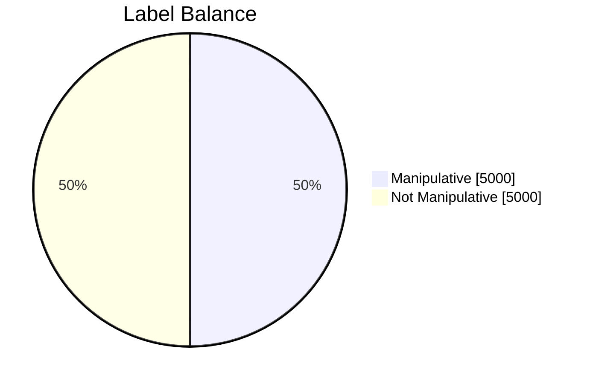

# Manipulation Detection

This project detects manipulative language in short text and returns a structured prediction, not just a binary flag. Given an input message, the system predicts:

- `label`: `manipulative` or `not_manipulative`
- `intent`: canonical user-facing intent category
- `intent_label`: normalized closed-set intent id
- `manipulation_type`: tactic such as `guilt`, `threat`, or `emotional_blackmail`
- `domain`: context such as `workplace`, `family`, `school`, `healthcare`, or `online`
- `severity`: `none`, `low`, `medium`, or `high`

The project exposes this through a FastAPI inference service and a Telegram bot.

## What The Project Does

At a high level, the system turns input text into TF-IDF features and runs a set of parallel classifiers over the same feature space. Instead of treating the task as a single yes or no problem, it predicts multiple attributes that help explain the text:

- Is the text manipulative?
- What is the likely intent?
- Which manipulation tactic is being used?
- What domain does the message belong to?
- How severe is the manipulation?

## Model Architecture

The model is implemented in `manipulation_model.py`.

- Input representation: shared TF-IDF feature space
- Feature types:
  - word-level TF-IDF with 1-2 grams
  - character-level TF-IDF with 3-5 character windows
- Classifiers: separate `LogisticRegression` models for:
  - `label`
  - `intent_label`
  - `manipulation_type`
  - `domain`
  - `severity`

The inference service maps `intent_label` back to a canonical human-readable `intent`.



## Dataset Summary

The training data is synthetic and generated by `build_manipulation_dataset.py`. The generator now creates a larger, noisier corpus that still preserves the project schema: it combines domain-specific actions, intent metadata, neutral/manipulative templates, and a real-world style augmentation pass with conversational openings, multi-sentence variants, contractions, casual chat tokens, and punctuation variation.

Current dataset used by default:

- File: `data/manipulation_detection_dataset.csv`
- Rows: `10,000`
- Raw columns: `8`
  - `id`
  - `text`
  - `label`
  - `intent_label`
  - `intent`
  - `manipulation_type`
  - `domain`
  - `severity`
- Model training columns: `7`
  - everything above except `id`
- Text feature matrix shape after vectorization: `10,000 x 16,535`

Distribution:

- Labels: `5,000 manipulative`, `5,000 not_manipulative`
- Domains: `10`, each with approximately `998-1003` rows
- Intent classes: `12`, each with approximately `831-836` rows
- Manipulation tactics: `15` tactic classes plus `none`



## Training Results

Training set accuracy on the current artifact (`manipulation_model.joblib`):

| Target | Training Accuracy |
| --- | ---: |
| `label` | `1.0000` |
| `intent_label` | `1.0000` |
| `manipulation_type` | `1.0000` |
| `domain` | `1.0000` |
| `severity` | `1.0000` |

These numbers are expectedly high because the dataset is synthetic, balanced, and internally consistent. They are useful as a sanity check that the pipeline is fitting correctly, but they are not the main generalization metric.

## Evaluation Results

Held-out evaluation uses `evaluate_model.py`, which runs 5-fold stratified cross-validation.

Latest cross-validation results:

| Target | Accuracy | Macro F1 | Weighted F1 |
| --- | ---: | ---: | ---: |
| `label` | `1.0000` | `1.0000` | `1.0000` |
| `intent_label` | `1.0000` | `1.0000` | `1.0000` |
| `manipulation_type` | `1.0000` | `1.0000` | `1.0000` |
| `domain` | `1.0000` | `1.0000` | `1.0000` |
| `severity` | `1.0000` | `1.0000` | `1.0000` |

Binary label report:

| Class | Precision | Recall | F1 |
| --- | ---: | ---: | ---: |
| `manipulative` | `1.00` | `1.00` | `1.00` |
| `not_manipulative` | `1.00` | `1.00` | `1.00` |

Important note: these results are strong because the project currently evaluates on synthetic folds drawn from the same data generation regime. Even after expanding the dataset to 10,000 rows and adding noisier real-world-style phrasing, the classes remain highly separable under this generator. If you want production-level confidence, the next step is evaluation on a separate external dataset or newly written human-authored examples.

## Inference Output

The FastAPI service returns:

```json
{
  "label": "manipulative",
  "is_manipulative": true,
  "intent_label": "request_review",
  "intent": "Request review before proceeding",
  "manipulation_type": "guilt",
  "domain": "workplace",
  "severity": "low",
  "confidence": 0.98,
  "intent_confidence": 0.94
}
```

## Project Files

- `build_manipulation_dataset.py`: builds the synthetic dataset
- `train_manipulation_model.py`: trains and saves the model artifact
- `manipulation_model.py`: shared training and inference logic
- `manipulation_inference.py`: FastAPI inference server and CLI prediction entrypoint
- `evaluate_model.py`: cross-validation evaluator
- `bot.py`: Telegram bot client for inference responses
- `manipulation_model.joblib`: saved trained artifact

## How To Run

Train the model:

```bash
.venv/bin/python train_manipulation_model.py
```

Run one local prediction:

```bash
.venv/bin/python manipulation_inference.py --text "If you cared, you would send the report tonight."
```

Start the API:

```bash
.venv/bin/python manipulation_inference.py
```

Run evaluation:

```bash
.venv/bin/python evaluate_model.py
```

Run the Telegram bot:

```bash
TELEGRAM_BOT_TOKEN=YOUR_TOKEN BACKEND_URL=http://localhost:8000/predict .venv/bin/python bot.py
```
